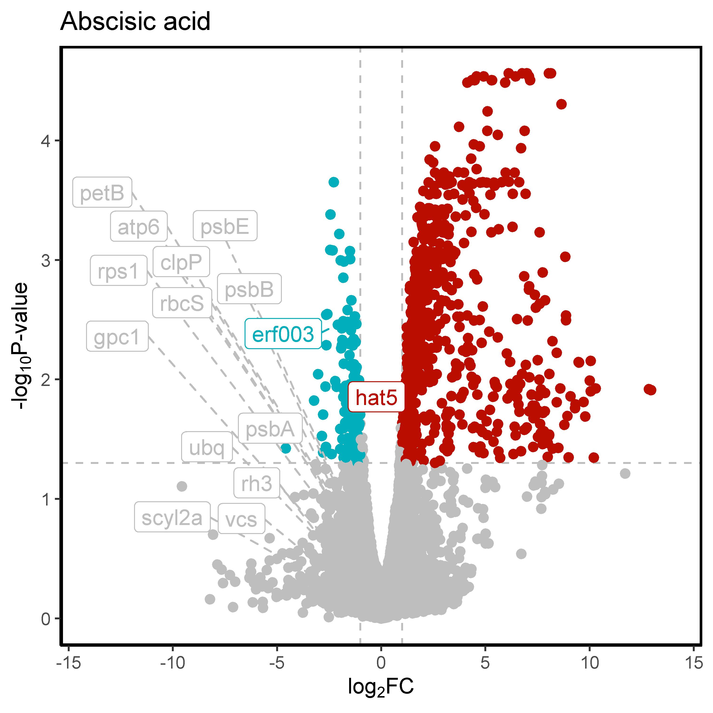
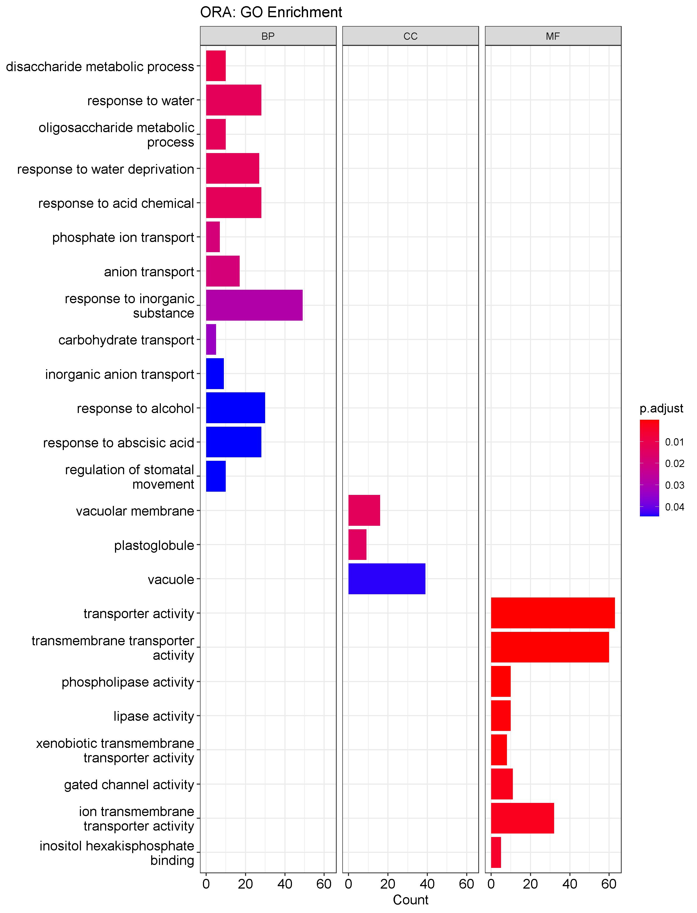
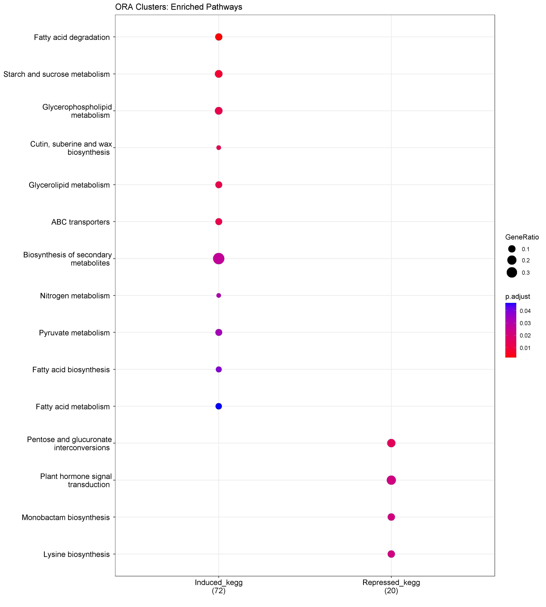
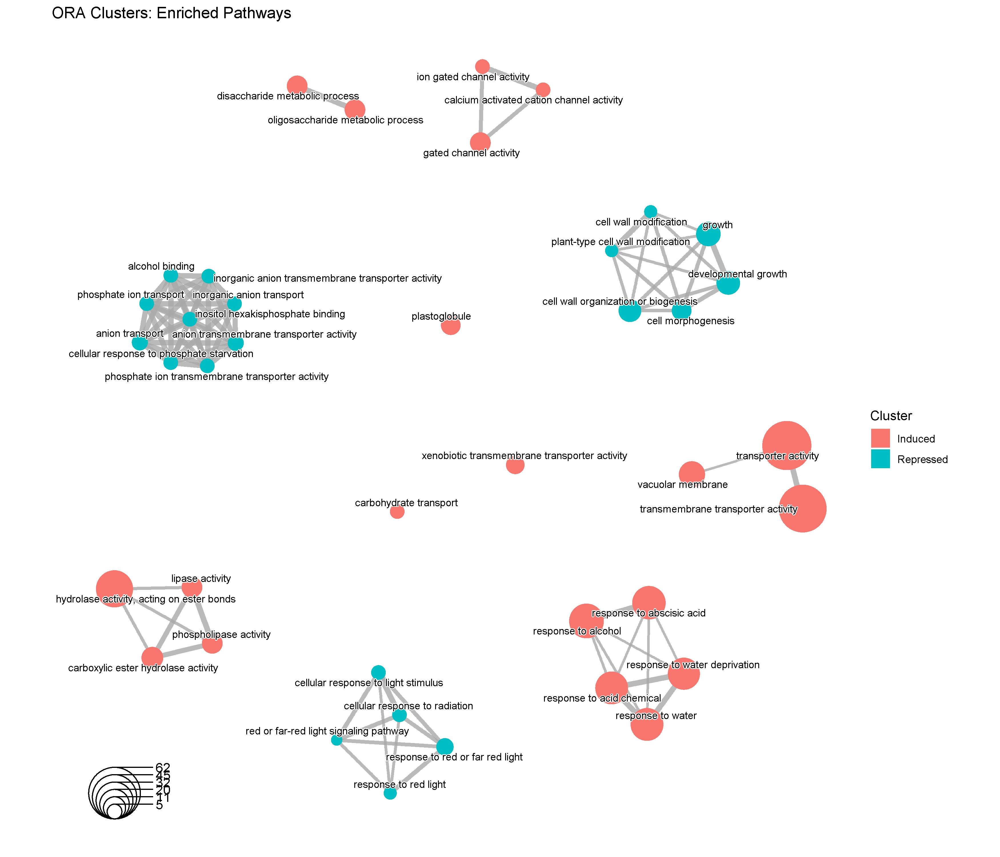
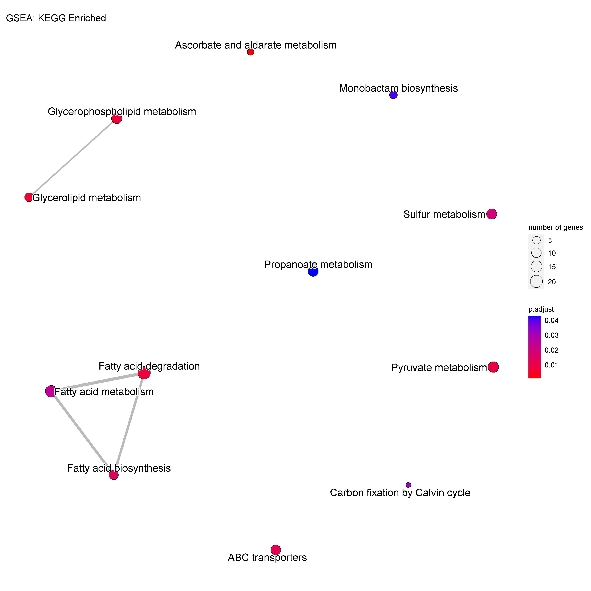
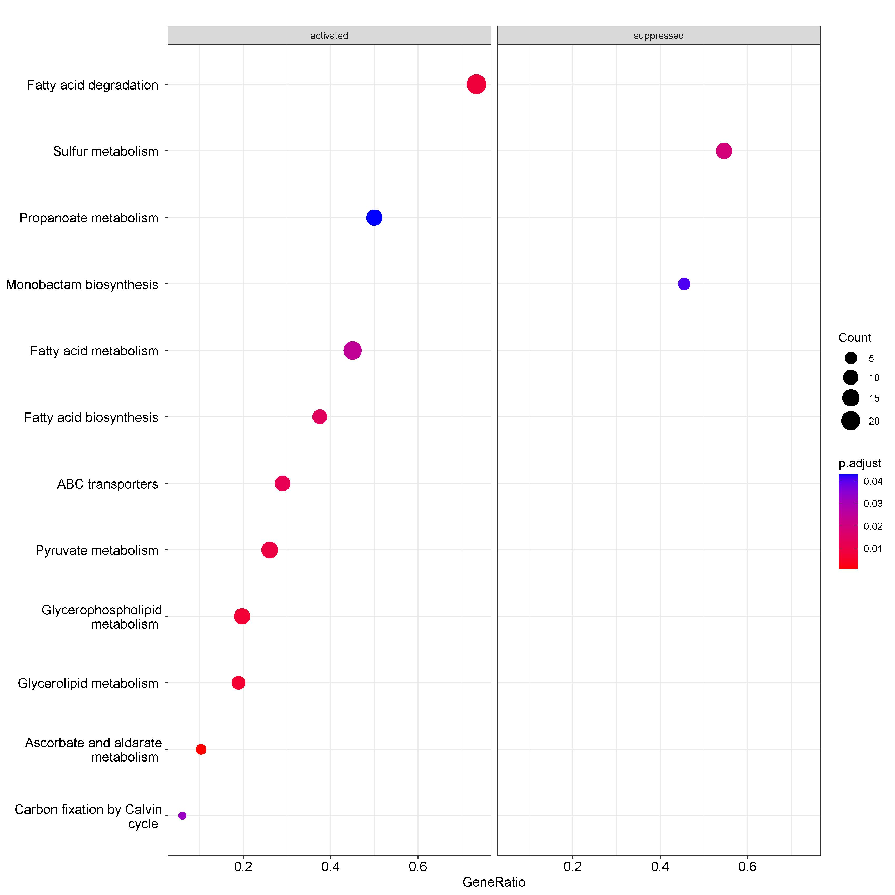
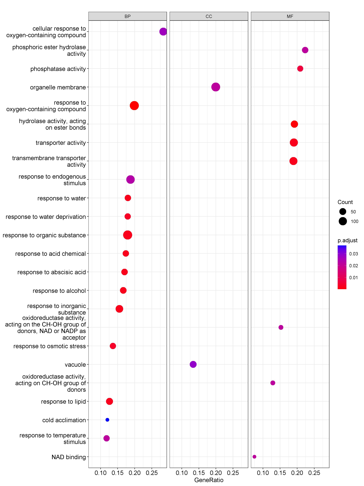
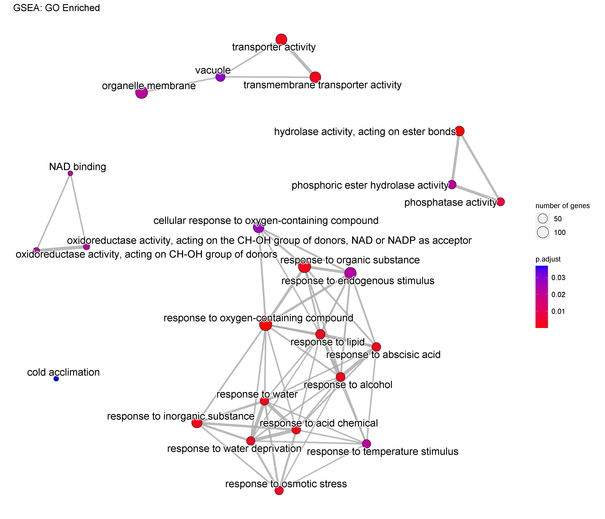
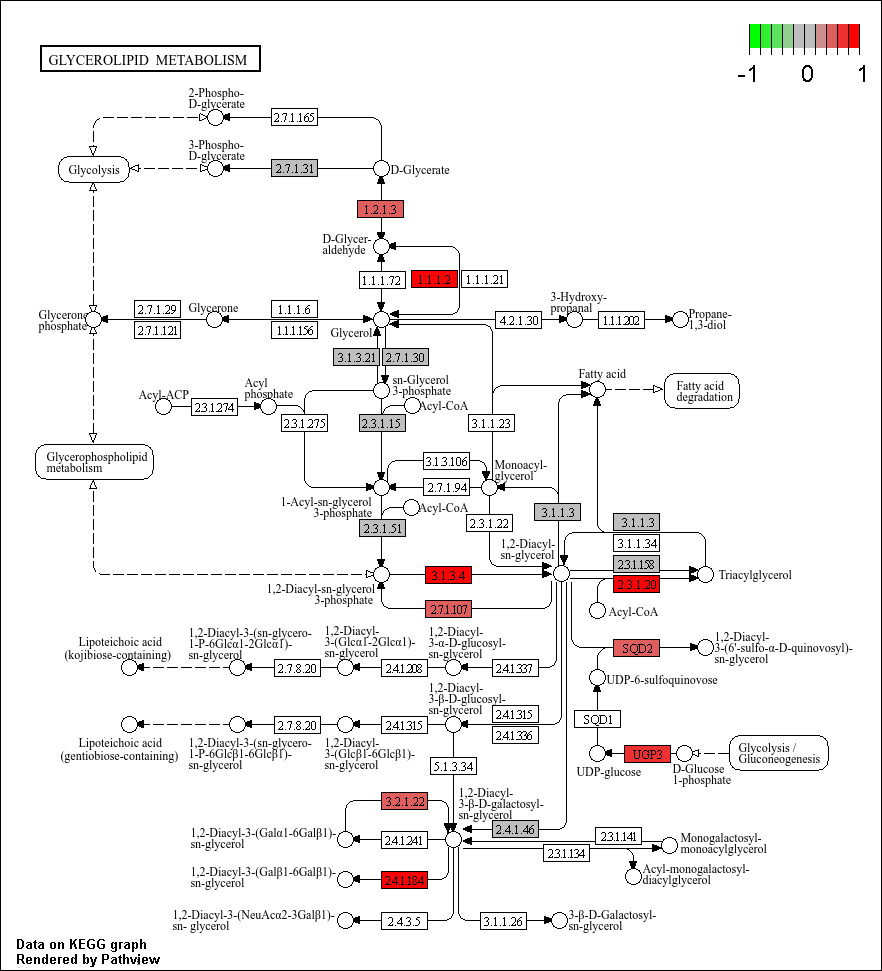

# 📦 DEGs Consensus & Enrichment

## 📝 Description (English)
R package for transcriptomic analysis: integrates **limma**, **DESeq2**, and **edgeR** results to build 2oo3 DEG consensus, generates labeled volcano plots, and performs functional enrichment (ORA/GSEA on GO and KEGG) with **clusterProfiler**. Outputs are publication-ready.  

## 📝 Descripción (Español)
Paquete en R para análisis transcriptómico: integra resultados de **limma**, **DESeq2** y **edgeR** para consenso de DEGs (2oo3), genera volcanos con etiquetas y realiza enriquecimiento funcional (ORA/GSEA en GO y KEGG) usando **clusterProfiler**. Resultados listos para publicación.  

---

## 🚀 Features
- DEG consensus from multiple tools (limma/DESeq2/edgeR)  
- Volcano plots with gene labels  
- Functional enrichment (ORA/GSEA) on GO and KEGG  
- Ready-to-use tables and figures for publications  

## 🔧 Requirements
- R (≥ 4.0)  
- Packages: `tidyverse`, `data.table`, `ggplot2`, `ggrepel`, `clusterProfiler`, `enrichplot`, `org.At.tair.db`, `pathview`  

## 📂 Outputs
- CSV files: DEGs universe, significant genes, consensus 2oo3  
- Volcano plots (with and without labels)

*Figure 1. Volcanoplot with labels.*  

- ORA and GSEA results (tables and visualizations such as the following among others)  

*Figure 2. ORA_GO_Bar_Ontology.*  

*Figure 3. ORA_KEGG_ClusterCompare_Dot_Ontology.*  

*Figure 4. ORA_KEGG_Clusters_EMap.*

*Figure 5. GSEA_KEGG_EMap.*  

*Figure 6. GSEA_KEGG_Dot.*  

*Figure 7. GSEA_GO_ONTOLOGY1_Dot.*  

*Figure 8. GSEA_GO_EMap.jpeg*  

*Figure 9.Volcanoplot with labels.*  

---

## 📜 License
[MIT](LICENSE)

## 👩‍💻 Author
Developed with ❤️ in R by [LinkedIn](https://www.linkedin.com/in/santiagovalentingalvangordillo) | [ORCID](https://orcid.org/0000-0001-6609-5661)   
